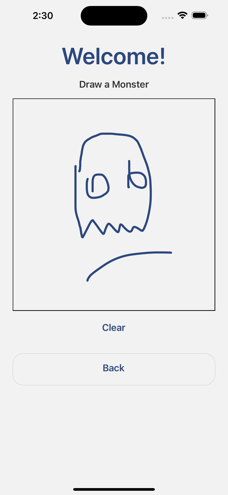
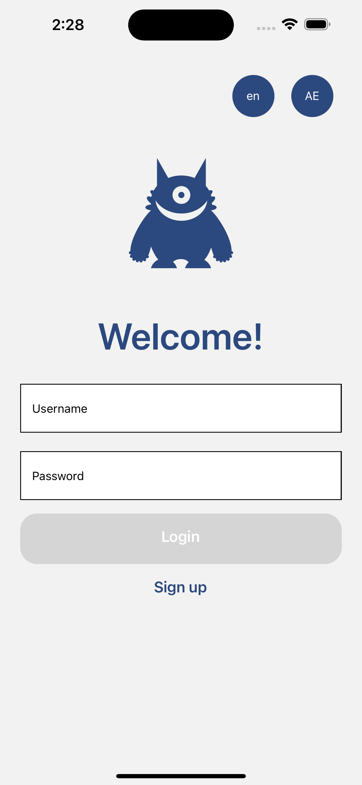
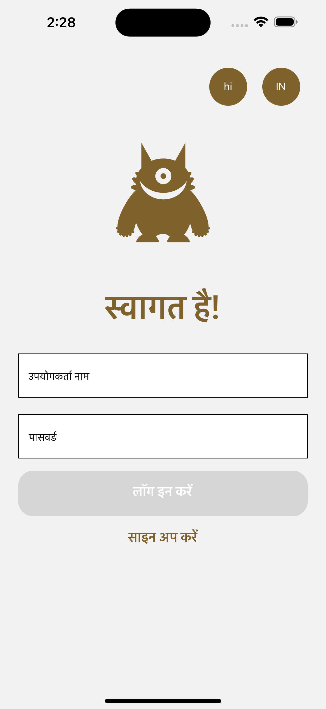
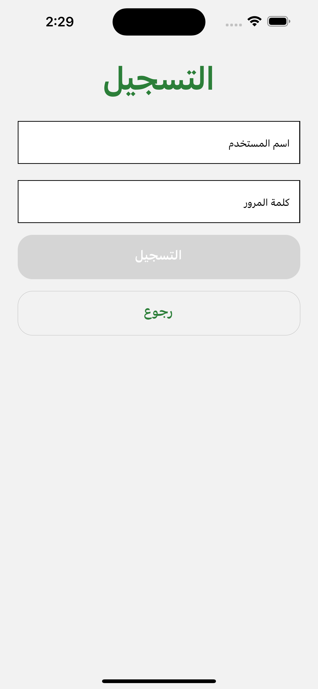

# MonsterApp

MonsterApp is a mobile application developed for the users to scribble on the device explore various Monster-related activities in their region of choice. It is currently available in 4 regions - United Arab Emirates, India, Pakistan and Egypt. The Application also supports 3 different languages - English, Arabic and Hindi


## Getting Started

These instructions will help you set up and run the MonsterApp on your local machine.

### Prerequisites

- [Node.js](https://nodejs.org/) (v16.0)
- [npm](https://www.npmjs.com/) or [Yarn](https://yarnpkg.com/)

### Installing

1. Clone the repository:


```bash
git clone https://github.com/teenakuriakose/mob-app.git
```

2. Navigate to the project directory:
  
```bash
cd mob-app/MonsterApp
```

3. Install dependencies: 
```bash
npm install
```
        or 
```bash
yarn install
 ```

### Running the App

1. To run the app on your local machine, use the following commands:

```bash
npm start
```
or 
```bash
yarn start
```

2. Navigate to ios folder and install pods

```bash
cd mob-app/MonsterApp/ios
```
```bash
pod install
```

3. To run the app in iOS 
   
Open the ios workspace n Xcode and click on the run build button.

or
        
```bash
yarn ios
``` 
 or 
```bash
npm run ios
```
4.  To run the app in Android
 ```bash
 yarn android
 ``` 
or 
```bash
npm run android
```

### A look inside!







